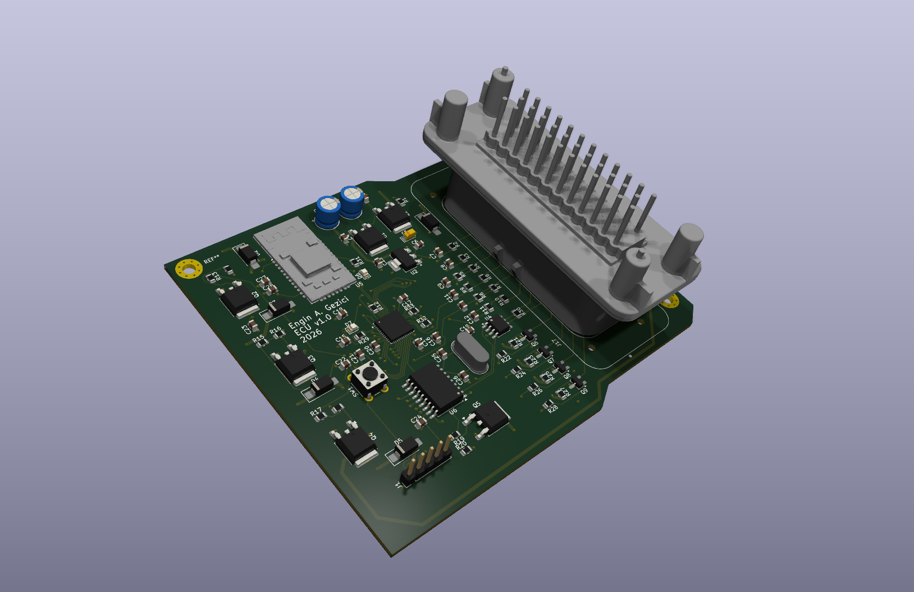
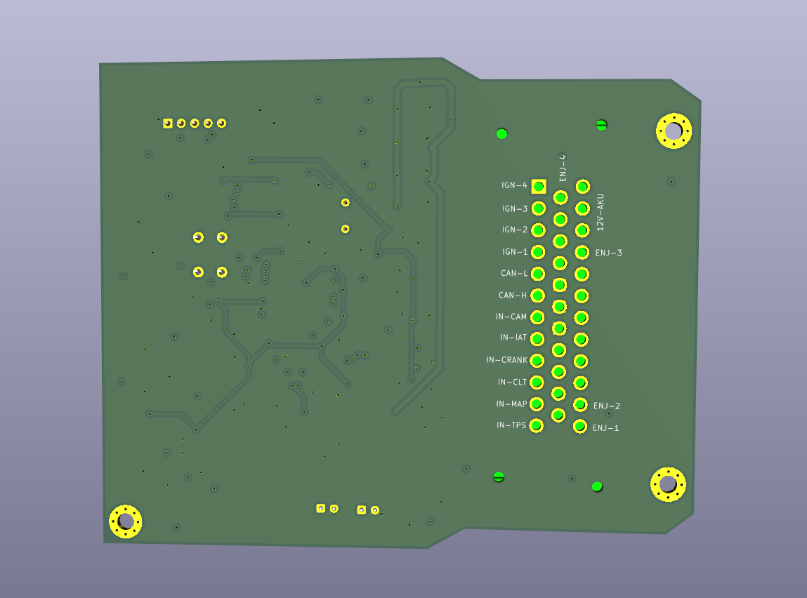

# ECU v1.0

KiCad ile tasarlanmış 4 katmanlı, 4 enjektör sürücülü, CAN ve Bluetooth destekli motor kontrol ünitesi (ECU) kartı.

> **Durum:** Tasarım tamamlandı (DRC temiz). Kart üretilmedi, proje öğrenme ve portföy amaçlıdır.

**Tasarım:** Engin A. Gezici, 2026

## Özellikler

- 4 kanal enjektör sürücüsü (N-MOSFET + Schottky flyback diyotları)
- 4 kanal ateşleme (IGN) çıkışı (NPN transistör)
- MCP2515 CAN denetleyicisi ve CAN transceiver
- RN42 Bluetooth modülü (kablosuz bağlantı)
- Sensör girişleri: TPS, MAP, CLT, IAT, CRANK, CAM
- 12V akü girişi: TVS diyot ve P-MOSFET ile ters polarite koruması
- L7805 ile 5V, ayrı regülatörle 3.3V
- Programlama/debug başlığı (J1) ve reset/buton (SW1)

## Görseller

## Katman dizilimi

| Katman | Kullanım |
|---|---|
| F.Cu | Bileşenler ve sinyal yolları (SPI, CAN, kristal, UART, gate) |
| In1.Cu | GND düzlemi |
| In2.Cu | 12V_AKU zone'u |
| B.Cu | GND zone'u ve uzun sinyal yolları |

RN42 anten alanında tüm katmanlarda bakır yasak bölgesi vardır.

## Konnektör pin haritası (J17)

| Grup | Pinler |
|---|---|
| Güç | 12V-AKU, GND |
| Enjektör çıkışları | ENJ-1, ENJ-2, ENJ-3, ENJ-4 |
| Ateşleme çıkışları | IGN-1, IGN-2, IGN-3, IGN-4 |
| CAN | CAN-H, CAN-L |
| Sensör girişleri | IN-TPS, IN-MAP, IN-CLT, IN-IAT, IN-CRANK, IN-CAM |

Pin numaralarını ve yönlerini tablo hâlinde eklemek istersen şemaya bakarak genişletebilirsin.

## Ana bileşenler

| Referans | Bileşen | Görev |
|---|---|---|
| U5 | RN42 | Bluetooth |
| U6 | MCP2515 | CAN denetleyici |
| U4 | CAN transceiver | CAN fiziksel katman |
| U1 | L7805 | 5V regülatör |
| U2 | 3.3V regülatör | 3.3V besleme |
| Q1 | P-MOSFET | Ters polarite koruması |
| D1 | TVS | Aşırı gerilim koruması |
| Q2-Q5 | N-MOSFET | Enjektör sürücü |
| Q6-Q9 | NPN | Ateşleme çıkışı |
| Y1 | 8 MHz kristal | MCP2515 saati |
| MCU | [MCU modeli] | Ana denetleyici |

## Dosyalar

- `ECU.kicad_pro`: proje dosyası
- `ECU.kicad_sch`: şema
- `ECU.kicad_pcb`: kart

KiCad [sürüm numarası] ile açılır.

## Tasarım notları

- 12V dağıtımı kalın izler yerine In2.Cu zone'u ile yapıldı.
- GND için In1.Cu ve B.Cu'da tam düzlem, bileşen GND pedleri via ile bağlanır.
- Kart kenarı pahlı, 4 adet şasi bağlantılı montaj deliği var.

## Yapılacaklar

- [ ] 12V girişe sigorta
- [ ] Güç LED'i
- [ ] Test noktaları
- [ ] Sensör girişlerine TVS/Zener koruma
- [ ] MOSFET gate Zener'leri
- [ ] CAN terminasyon jumper'ı

